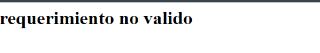
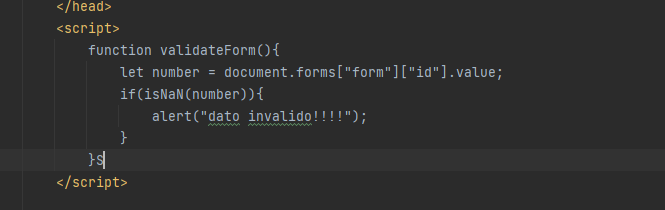
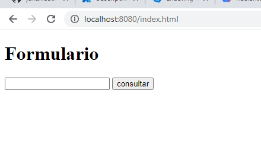
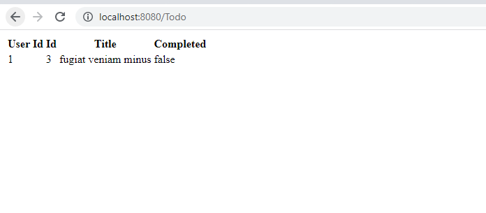
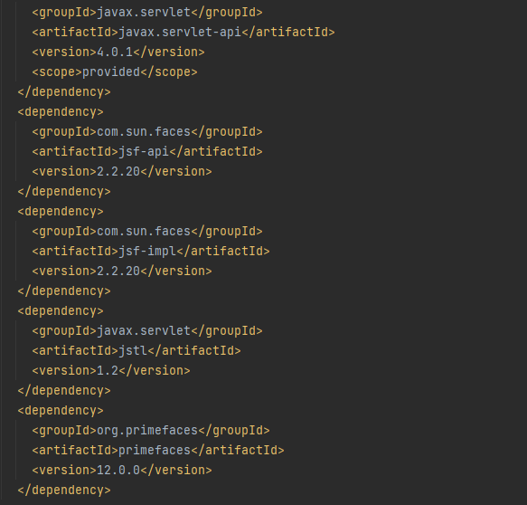
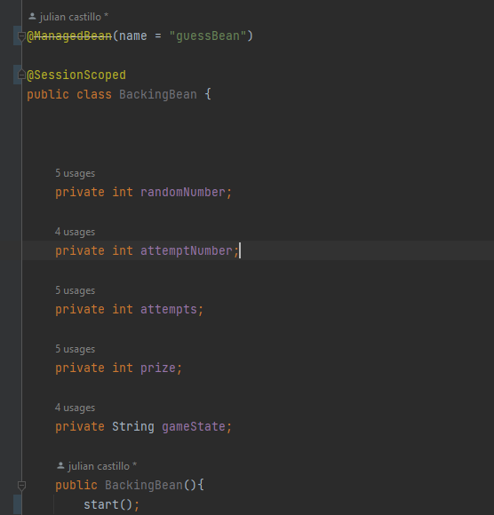
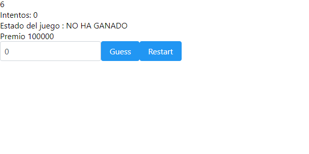


#### 	

CICLOS DE VIDA DEL DESARROLLO DE SOFTWARE 2022-1

Dashboard / My courses / CVDS\_2022-1 / Semana 6 / Laboratorio 5 - MVC Primefaces Introduction - 2022-1

## LABORATORIO 5 - MVC PRIMEFACES INTRODUCTION - 2022-1
## Camilo Andrés Cantillo Tatis
## Julian David Castillo Soto
Taller 4

# TALLER 5
ESCUELA COLOMBIANA DE INGENIERÍA INTRODUCCIÓN A PROYECTOS WEB
# PARTE I. - JUGANDO A SER UN CLIENTE HTTP
1. Abra una terminal Linux o consola de comandos Windows.
1. Realice una conexión síncrona TCP/IP a través de Telnet al siguiente servidor: Host: [www.escuelaing.edu.co](http://www.escuelaing.edu.co/)

Puerto: 80

Teniendo en cuenta los parámetros del comando telnet:

telnet HOST PORT

1. Antes de que el servidor cierre la conexión por falta de comunicación:

Revise la página 36 del [RFC del protocolo HTTP](https://tools.ietf.org/html/rfc2616), sobre cómo realizar una petición GET. Con esto, solicite al servidor el recurso ‘sssss/abc.html’, usando la versión 1.0 de HTTP.

**Se utiliza el comando “GET /sssss/abc.html HTTP/1.0”**

Asegúrese de presionar ENTER dos veces después de ingresar el comando.

Revise el resultado obtenido. ¿Qué codigo de error sale?, revise el significado del mismo en [la lista de cód](https://en.wikipedia.org/wiki/List_of_HTTP_status_codes)[ig](https://en.wikipedia.org/wiki/List_of_HTTP_status_codes)[os de estado HTTP](https://en.wikipedia.org/wiki/List_of_HTTP_status_codes).

**400 Bad Request**, El servidor no procesará la solicitud, porque no puede, o no debe, debido a algo que es percibido como un error del cliente (ej: solicitud malformada, sintaxis errónea, etc). La solicitud contiene sintaxis errónea y no debería repetirse.

¿Qué otros códigos de error existen?, ¿En qué caso se manejarán?

Hay 28 tipos de errores pero los mas conocidos son los 400, 401, 402, 403 y 404

**401(Unauthorized)**: no se tiene permiso para recibir el contenido.

**402(Payment Required)**:La intención original era que este código pudiese ser usado como parte de alguna forma o esquema de dinero electrónico o micro pago[s](https://es.wikipedia.org/wiki/Micropago), pero eso no sucedió, y este código nunca se utilizó.

**403(Forbidden)**: la petición es correcta pero el servidor se niega a ofrecerte el recurso o página web. Es posible que necesites una cuenta en el servicio e iniciar sesión antes de poder acceder, por consecuente mandara el error 401 ya que se debe autenticar o de alguna forma iniciar sesión.

**404(Not Found)**:Recurso no encontrado. Se utiliza cuando el servidor web no encuentra la página o recurso solicitado.

1. Realice una nueva conexión con telnet, esta vez a: Host: [www.httpbin.org](http://www.httpbin.org/)

Puerto: 80

Versión HTTP: 1.1

Ahora, solicite (GET) el recurso */html*. ¿Qué se obtiene como resultado?

¡Muy bien!, ¡Acaba de usar del protocolo HTTP sin un navegador Web!. Cada vez que se usa un navegador, éste se conecta a un servidor HTTP, envía peticiones (del protocolo HTTP), espera el resultado de las mismas, y -si se trata de contenido HTML- lo interpreta y dibuja.

1. Seleccione el contenido HTML de la respuesta y copielo al cortapapeles CTRL-SHIFT-C. Ejecute el comando wc (*word count*) para contar palabras con la opción -c para contar el número de caracteres:

wc -c

Pegue el contenido del portapapeles con CTRL-SHIFT-V y presione CTRL-D (fin de archivo de Linux). Si no termina el comando wc presione CTRL-D de nuevo. No presione mas de dos veces CTRL-D indica que se termino la entrada y puede cerrarle la terminal. Debe salir el resultado de la cantidad de caracteres que tiene el contenido HTML que respondió el servidor.

Al final de la búsqueda se logra observar el valor 3725

Claro está, las peticiones GET son insuficientes en muchos casos. Investigue: ¿Cuál es la diferencia entre los verbos GET y POST? ¿Qué otros tipos de peticiones existen?

1. En la practica no se utiliza telnet para hacer peticiones a sitios web sino el comando curl con ayuda de la linea de comandos:

curl www.httpbin.org

Utilice ahora el parámetro -v y con el parámetro -i:

curl -v www.httpbin.org curl -i www.httpbin.org

¿Cuáles son las diferencias con los diferentes parámetros?

**curl -i** sirve para ver el encabezado de respuesta con el contenido 

**curl -v** muestra la solicitud, los encabezados de respuesta y detalles informativos adicionales sobre la transferencia realizada** 

`                 `

# PARTE II. - HACIENDO UNA APLICACIÓN WEB DINÁMICA A BAJO NIVEL.
En este ejercicio, va a implementar una aplicación Web muy básica, haciendo uso de los elementos de más bajo nivel de Java-EE (Enterprise Edition), con el fin de revisar los conceptos del protocolo HTTP. En este caso, se trata de un módulo de consulta de clientes Web que hace uso de una librería de acceso a datos disponible en un repositorio Maven local.

1. Para esto, cree un proyecto maven nuevo usando el arquetipo de aplicación Web estándar maven-archetype-webapp y realice lo siguiente:

1. Revise la clase SampleServlet incluida a continuacion, e identifique qué hace:

package edu.eci.cvds.servlet;

import java.io.IOException; import java.io.Writer;

import java.util.Optional;

import javax.servlet.ServletException;

import javax.servlet.annotation.WebServlet; import javax.servlet.http.HttpServlet;

import javax.servlet.http.HttpServletRequest; import javax.servlet.http.HttpServletResponse;

@WebServlet(

urlPatterns = "/helloServlet"

)

public class SampleServlet extends HttpServlet{ static final long serialVersionUID = 35L;

@Override

protected void doGet(HttpServletRequest req, HttpServletResponse resp) throws ServletException, IOException { Writer responseWriter = resp.getWriter();

Optional<String> optName = Optional.ofNullable(req.getParameter("name"));

String name = optName.isPresent() && !optName.get().isEmpty() ? optName.get() : "";

resp.setStatus(HttpServletResponse.SC\_OK); responseWriter.write("Hello" + name + "!"); responseWriter.flush();

}

}

Revise qué valor tiene el parámetro ‘urlPatterns’ de la anotación [@WebServlet](http://docs.oracle.com/javaee/6/tutorial/doc/bnafu.html), pues este indica qué URLs atiende las peticiones el servlet.

RTA: El fragmento de código anterior hace referencia a la petición GET del protocolo http, con el path helloServlet

1. En el pom.xml, modifique la propiedad "packaging" con el valor "war". Agregue la siguiente dependencia:

<dependency>

<groupId>javax</groupId>

<artifactId>javaee-web-api</artifactId>

<version>7.0</version>

<scope>provided</scope>

</dependency>

y agregue la seccion build al final del tag project en el archivo pom.xml:

<build>

<plugins>

<plugin>

<groupId>org.apache.maven.plugins</groupId>

<artifactId>maven-compiler-plugin</artifactId>

<version>3.8.0</version>

<configuration>

<source>1.8</source>

<target>1.8</target>

</configuration>

</plugin>

<plugin>

<groupId>org.apache.maven.plugins</groupId>

<artifactId>maven-war-plugin</artifactId>

<version>2.3</version>

<configuration>

<failOnMissingWebXml>false</failOnMissingWebXml>

</configuration>

</plugin>

<plugin>

<groupId>org.apache.maven.plugins</groupId>

<artifactId>maven-dependency-plugin</artifactId>

<version>2.6</version>

<executions>

<execution>

<phase>validate</phase>

<goals>

<goal>copy</goal>

</goals>

<configuration>

<silent>true</silent>

<artifactItems>

<artifactItem>

<groupId>javax</groupId>

<artifactId>javaee-endorsed-api</artifactId>

<version>7.0</version>

<type>jar</type>

</artifactItem>

</artifactItems>

</configuration>

</execution>

</executions>

</plugin>

<!-- Tomcat embedded plugin. -->

<plugin>

<groupId>org.apache.tomcat.maven</groupId>

<artifactId>tomcat7-maven-plugin</artifactId>

<version>2.2</version>

<configuration>

<port>8080</port>

<path>/</path>

</configuration>

</plugin>

</plugins>

</build>

1. Revise en el pom.xml para qué puerto TCP/IP está configurado el servidor embebido de Tomcat (ver sección de plugins).

Por el puerto 8080

1. Compile y ejecute la aplicación en el servidor embebido Tomcat, a través de Maven con:

mvn package

mvn tomcat7:run

1. Abra un navegador, y en la barra de direcciones ponga la URL con la cual se le enviarán peticiones al ‘SampleServlet’. Tenga en cuenta que la URL tendrá como host ‘localhost’, como puerto, el configurado en el pom.xml y el path debe ser el del Servlet. Debería obtener un mensaje de saludo.

1. Observe que el Servlet ‘SampleServlet’ acepta peticiones GET, y opcionalmente, lee el parámetro ‘name’. Ingrese la misma URL, pero ahora agregando un parámetro GET (si no sabe como hacerlo, revise la documentación en [http://www.w3schools.com/tags/ref_httpmethods.asp).](http://www.w3schools.com/tags/ref_httpmethods.asp\))

1. Busque el artefacto gson en el repositorio de maven y agregue la dependencia.

1. En el navegador revise la dirección <https://jsonplaceholder.typicode.com/todos/1>. Intente cambiando diferentes números al final del path de la url.

1. Basado en la respuesta que le da el servicio del punto anterior, cree la clase edu.eci.cvds.servlet.model.Todo con un constructor vacío y los métodos getter y setter para las propiedades de los "To Dos" que se encuentran en la url indicada.

1. Utilice la siguiente clase para consumir el servicio que se encuentra en la dirección url del punto anterior:

package edu.eci.cvds.servlet;

import java.io.BufferedReader; import java.io.IOException;

import java.io.InputStreamReader;

import java.net.MalformedURLException; import java.net.URL;

import java.net.URLConnection; import java.util.List;

import com.google.gson.Gson;

import edu.eci.cvds.servlet.model.Todo; public class Service {

public static Todo getTodo(int id) throws MalformedURLException, IOException { URL urldemo = new URL("https://jsonplaceholder.typicode.com/todos/" + id); URLConnection yc = urldemo.openConnection();

BufferedReader in = new BufferedReader(new InputStreamReader(yc.getInputStream())); Gson gson = new Gson();

Todo todo = gson.fromJson(in, Todo.class); in.close();

return todo;

}

private static String todoToHTMLRow(Todo todo) { return new StringBuilder("<tr>")

.append("<td>")

.append(todo.getUserId())

.append("</td><td>")

.append(todo.getId())

.append("</td><td>")

.append(todo.getTitle())

.append("</td><td>")

.append(todo.getCompleted())

.append("</td>")

.append("</tr>")

.toString();

}

public static String todosToHTMLTable(List<Todo> todoList) {

StringBuilder stringBuilder = new StringBuilder("<table>")

.append("<tr>")

.append("<th>User Id</th>")

.append("<th>Id</th>")

.append("<th>Title</th>")

.append("<th>Completed</th>")

.append("</tr>");

for (Todo todo : todoList) {

stringBuilder.append(todoToHTMLRow(todo));

}

return stringBuilder.append("</table>").toString();

}

}

1. Cree una clase que herede de la clase HttpServlet (similar a SampleServlet), y para la misma sobrescriba el método heredado doGet. Incluya la anotación @Override para verificar –en tiempo de compilación- que efectivamente se esté sobreescribiendo un método de las superclases.

1. Para indicar en qué URL el servlet interceptará las peticiones GET, agregue al método la anotación @WebServlet, y en dicha anotación, defina la propiedad urlPatterns, indicando la URL (que usted defina) a la cual se asociará el servlet.

1. Teniendo en cuenta las siguientes métodos disponibles en los objetos ServletRequest y ServletResponse recibidos por el método doGet:

response.setStatus(N); <- Indica con qué código de error N se generará la respuesta. Usar la clase HttpServletResponse para indicar el código de respuesta.

request.getParameter(param); <- Consulta el parámetro recibido, asociado al nombre ‘param’.

response.getWriter() <- Retorna un objeto PrintWriter a través del cual se le puede enviar la respuesta a quien hizo la petición. response.setContentType(T) <- Asigna el tipo de contenido (MIME type) que se entregará en la respuesta.

Implemente dicho método de manera que:

Asuma que la petición HTTP recibe como parámetro el número de id de una lista de cosas por hacer (todo), y que dicha identificación es un número entero.

Con el identificador recibido, consulte el item por hacer de la lista de cosas por hacer, usando la clase "Service" creada en el punto 10.

Si el item existe:

Responder con el código HTTP que equivale a ‘OK’ ([ver referencia anterior](https://en.wikipedia.org/wiki/List_of_HTTP_status_codes)), y como contenido de dicha respuesta, el código html

correspondiente a una página con una tabla que tenga los detalles del item, usando la clase "Service" creada en el punto 10 par crear la tabla.

Si el item no existe:

Responder con el código correspondiente a ‘no encontrado’, y con el código de una página html que indique que no existe un item con el identificador dado.

Si no se paso parámetro opcional, o si el parámetro no contiene un número entero, devolver el código equivalente a requerimiento inválido.

Si se genera la excepcion MalformedURLException devolver el código de error interno en el servidor

Para cualquier otra excepcion, devolver el código equivalente a requerimiento inválido.

1. Una vez hecho esto, verifique el funcionamiento de la aplicación, recompile y ejecute la aplicación.

1. Intente hacer diferentes consultas desde un navegador Web para probar las diferentes funcionalidades.

error de parámetro

consulta web correcta

# PARTE III.
1. En su servlet, sobreescriba el método doPost, y haga la misma implementación del doGet.

1. Cree el archivo index.html en el directorio src/main/webapp/index.html de la siguiente manera:

<!DOCTYPE html>

<html>

<head>

<title>Start Page</title>

<meta http-equiv="Content-Type" content="text/html; charset=UTF-8">

</head>

<body>

<h1>Hello World!</h1>

</body>

</html>

1. En la página anterior, cree un formulario que tenga un campo para ingresar un número (si no ha manejado html antes, revise [http://www.w3schools.com/html/ ](http://www.w3schools.com/html/)) y un botón. El formulario debe usar como método ‘POST’, y como acción, la ruta relativa del último servlet creado (es decir la URL pero excluyendo ‘http://localhost:8080/’).

1. Revise [este ejemplo de validación de formularios con javascript](http://www.w3schools.com/js/js_validation.asp)y agruéguelo a su formulario, de manera que -al momento de hacer ‘submit’- desde el browser se valide que el valor ingresado es un valor numérico.

1. Recompile y ejecute la aplicación. Abra en su navegador en la página del formulario, y rectifique que la página hecha anteriormente sea mostrada. Ingrese los datos y verifique los resultados. Cambie el formulario para que ahora en lugar de POST, use el método GET . Qué diferencia observa?

`	`No encuentro ninguna diferencia clara, sin embargo a la hora de hacer la consulta la diferencia es que el formulario hace que el parametro lo asigne el usuario de una forma mas cómoda.

1. ¿Qué se está viendo? Revise cómo están implementados los métodos de la clase Service.java para entender el funcionamiento interno.

# PARTE IV. - FRAMEWORKS WEB MVC – JAVA SERVER FACES / PRIME FACES
En este ejercicio, usted va a desarrollar una aplicación Web basada en el marco JSF, y en una de sus implementaciones más usadas: [PrimeFaces](http://primefaces.org/). Se trata de un juego en línea para adivinar un número, en el que el ganador, si atina en la primera oportunidad, recibe $100.000. Luego, por cada intento fallido, el premio se reduce en $10.000.

1. Al proyecto Maven, debe agregarle las dependencias mas recientes de javax.javaee-api, com.sun.faces.jsf-api, com.sun.faces.jsf-impl, javax.servlet.jstl y Primefaces (en el archivo pom.xml).

1. Para que configure automáticamente el descriptor de despliegue de la aplicación (archivo web.xml), de manera que el *framework* JSF se active al inicio de la aplicación, en el archivo web.xml agregue la siguiente configuración:

<servlet>

<servlet-name>Faces Servlet</servlet-name>

<servlet-class>javax.faces.webapp.FacesServlet</servlet-class>

<load-on-startup>1</load-on-startup>

</servlet>

<servlet-mapping>

<servlet-name>Faces Servlet</servlet-name>

<url-pattern>/faces/\*</url-pattern>

</servlet-mapping>

<welcome-file-list>

<welcome-file>faces/index.jsp</welcome-file>

</welcome-file-list>

1. Revise cada una de las configuraciones agregadas anteriormente para saber qué hacen y por qué se necesitan. Elimine las que no se necesiten.

1. Ahora, va a crear un Backing-Bean de sesión, el cual, para cada usuario, mantendrá de lado del servidor las siguientes propiedades:

1. El número que actualmente debe adivinar (debe ser un número aleatorio).

1. El número de intentos realizados.

1. El premio acumulado hasta el momento.

1. El estado del juego, que sería una cadena de texto que indica si ya ganó o no, y si ganó de cuanto es el premio.

Para hacer esto, cree una clase que tenga:

el constructor por defecto (sin parámetros)

los métodos get/set necesarios dependiendo si las propiedades son de escritura o lectura coloque las anotaciones:

@ManagedBean, incluyendo el nombre: @ManagedBean(name = "guessBean"). @ApplicationScoped.

A la implementación de esta clase, agregue los siguientes métodos:

guess: Debe recibir un intento de adivinanza y realizar la lógica para saber si se adivinó, de tal forma que se ajuste el valor del premio y/o actualice el estado del juego.

restart: Debe volver a iniciar el juego (inicializar de nuevo el número a adivinar, y restaurar el premio a su valor original).

1. Cree una página XHTML, de nombre guess.xhtml (debe quedar en la ruta src/main/webapp). Revise en la [p](http://www.primefaces.org/docs/guide/primefaces_user_guide_5_2.pdf)[á](http://www.primefaces.org/docs/guide/primefaces_user_guide_5_2.pdf)[g](http://www.primefaces.org/docs/guide/primefaces_user_guide_5_2.pdf)[ina 1](http://www.primefaces.org/docs/guide/primefaces_user_guide_5_2.pdf)[3](http://www.primefaces.org/docs/guide/primefaces_user_guide_5_2.pdf)[ del manual de PrimeFaces](http://www.primefaces.org/docs/guide/primefaces_user_guide_5_2.pdf), qué espacios de nombres XML requiere una página de PrimeFaces y cuál es la estructura básica de la misma.

1. Con base en lo anterior, agregue un formulario con identificador guess\_form con el siguiente contenido básico:

<h:body>

<h:form id="guess\_form">

</h:form>

</h:body>

1. Al formulario, agregue:

1. Un elemento de tipo <p:outputLabel> para el número que se debe adivinar, sin embargo, este elemento se debe ocultar. Para ocultarlo, se puede agregar el estilo display: none; al elemento. Una forma de hacerlo es por medio de la propiedad style.

En una aplicacion real, no se debería tener este elemento, solo se crea con el fin de simplificar una prueba futura.

1. Un elemento <p:inputText> para que el usuario ingrese su número.

1. Un elemento de tipo <p:outputLabel> para mostrar el número de intentos realizados.

1. Un elemento de tipo <p:outputLabel> para mostrar el estado del juego.

1. Un elemento de tipo <p:outputLabel> para mostrar en cuanto va el premio.

Y asocie dichos elementos al BackingBean de sesión a través de su propiedad value, y usando como referencia el nombre asignado:

value="#{guessBean.nombrePropiedad}"

1. Al formulario, agregue dos botones de tipo <p:commandButton>, uno para enviar el número ingresado y ver si se *atinó*, y otro para reiniciar el juego.

1. El botón de *envío de adivinanza* debe tener asociado a su propiedad update el nombre del formulario en el que se agregaron los campos antes descritos, de manera que al hacer clic, se ejecute un ciclo de JSF y se *refresque* la vista.
1. Debe tener también una propiedad actionListener con la cual se le indicará que, al hacer clic, se ejecutará el método guess, creado en el backing-bean de sesión:

<p:commandButton update="guess\_form" actionListener="#{guessBean.guess}">...

1. El botón de reiniciar juego tendrá las mismas propiedades de update y actionListener del otro con el valor correspondiente:

<p:commandButton update="…" actionListener="…">

1. Para verificar el funcionamiento de la aplicación, agregue el plugin tomcat-runner dentro de los plugins de la fase de construcción (build). Tenga en cuenta que en la configuración del plugin se indica bajo qué ruta quedará la aplicación:

1. mvn package

1. mvn tomcat7:run

Si no hay errores, la aplicación debería quedar accesible en la URL: http://localhost:8080/faces/guess.xhtml

1. Si todo funcionó correctamente, realice las siguientes pruebas:

1. Abra la aplicación en un explorador. Realice algunas pruebas con el juego e intente adivinar el número.

1. Abra la aplicación en dos computadores diferentes. Si no dispone de uno, hágalo en dos navegadores diferentes (por ejemplo Chrome y Firefox; incluso se puede en un único navegador usando una ventana normal y una ventana de incógnito / privada). Haga cinco intentos en uno, y luego un intento en el otro. ¿Qué valor tiene cada uno?

1. Aborte el proceso de Tomcat-runner haciendo Ctrl+C en la consola, y modifique el código del backing-bean de manera que use la anotación @SessionScoped en lugar de @ApplicationScoped. Reinicie la aplicación y repita el ejercicio anterior.

¿Coinciden los valores del premio?.

Dado la anterior, ¿Cuál es la diferencia entre los backing-beans de sesión y los de aplicación?

1. Por medio de las herramientas de desarrollador del explorador (Usando la tecla "F12" en la mayoría de exploradores): Ubique el código HTML generado por el servidor.

Busque el elemento oculto, que contiene el número generado aleatoriamente.

En la sección de estilos, deshabilite el estilo que oculta el elemento para que sea visible. Observe el cambio en la página, cada vez que se realiza un cambio en el estilo.

Revise qué otros estilos se pueden agregar a los diferentes elementos y qué efecto tienen en la visualización de la página.

Actualice la página. Los cambios de estilos realizados desaparecen, pues se realizaron únicamente en la visualización, la respuesta del servidor sigue siendo la misma, ya que el contenido de los archivos allí almacenados no se ha modificado.

Revise qué otros cambios se pueden realizar y qué otra información se puede obtener de las herramientas de desarrollador.

1. Para facilitar los intentos del usuario, se agregará una lista de los últimos intentos fallidos realizados:

a. Agregue en el Backing-Bean, una propiedad que contenga una lista de intentados realizados.

b. Agregue cada intento a la lista, cuando se ejecute el método guess.

c. Cuando se reinicie el juego, limpie el contenido de la lista.

d. Busque cómo agregar una tabla a la página, cuyo contenido sea los últimos intentos realizados.

ENTREGA

Dentro del directorio coloque un archivo de texto integrantes.txt con el nombre de los integrantes del taller (máximo 2). configurar el archivo .gitignore para excluir del repositorio los archivos no relevantes.

Realizar un diagrama de clases del proyecto.

En un archivo de texto coloque las respuestas a las preguntas de la parte 3 (diferencias encontradas entre usar un GET o un POST, qué otros métodos similares existen y para qué es cada uno, información del punto 20 y 21).

GRADING SUMMARY

Hidden from students	No

Participants	0

Submitted	0
### **ENLACES INSTITUCIONALES**
[Biblioteca](https://www.escuelaing.edu.co/es/campus/biblioteca/)

[Investigación e innovación](https://www.escuelaing.edu.co/es/investigacion-e-innovacion/) [Enlace - Académico](https://enlace-academico.escuelaing.edu.co/psp/ECCS92PR/?cmd=login&languageCd=ESP)
### **ENLACES DE INTERÉS**
[Ministerio de Educación Nacional](https://www.mineducacion.gov.co/portal/) [Colombia Aprende](https://www.colombiaaprende.edu.co/)

[Red Latinoamericana de Portales Educativos](http://www.relpe.org/) [Red Universitarias Metropolitana de Bogotá](http://www.rumbo.edu.co/)
### **CONTACT US**
AK.45 No.205-59 (Autopista Norte).

Phone: +57(1) 668 3600

E-mail: <contactocc@escuelaing.edu.co>

Needs grading	0
Copyright © 2017 - Developed by [LMSACE.com](http://lmsace.com/). Powered by [Moodle](https://moodle.org/)

a

ta retention summary

t the mobile app
[D ](https://campusvirtual.escuelaing.edu.co/moodle/admin/tool/dataprivacy/summary.php)

[Ge ](https://download.moodle.org/mobile?version=2020061513.05&lang=en&iosappid=633359593&androidappid=com.moodle.moodlemobile)[Due date](https://download.moodle.org/mobile?version=2020061513.05&lang=en&iosappid=633359593&androidappid=com.moodle.moodlemobile)	Saturday, 5 March 2022, 10:00 AM

Time remaining	Assignment is due

Late submissions	Only allowed for participants who have been granted an extension

#### [View all submissions](https://campusvirtual.escuelaing.edu.co/moodle/mod/assign/view.php?id=113254&action=grading)	[Grade](https://campusvirtual.escuelaing.edu.co/moodle/mod/assign/view.php?id=113254&action=grader)

[◄ Laboratorio 5 - MVC Primefaces Introduction - 2019-2 (hidden)](https://campusvirtual.escuelaing.edu.co/moodle/mod/assign/view.php?id=75507&forceview=1)

Jump to...

#### [Laboratorio 5 - MVC Primefaces Introduction - 2021-2 (hidden) ►](https://campusvirtual.escuelaing.edu.co/moodle/mod/assign/view.php?id=143047&forceview=1)
